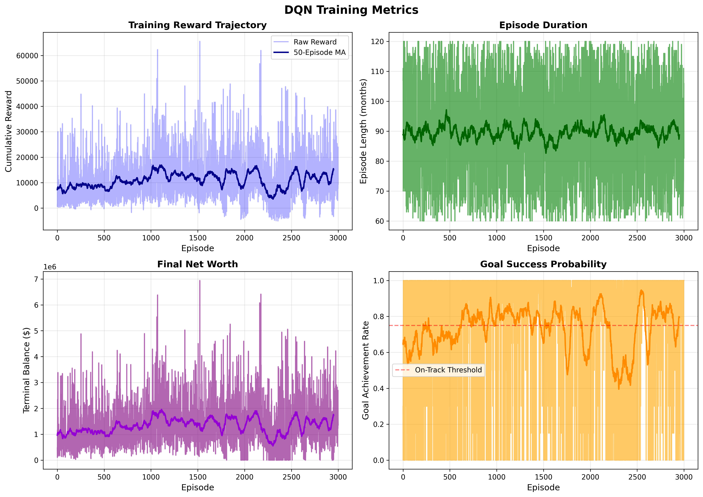

A Hybrid Multi-Agent Framework with Reinforcement Learning for Personalized Financial Planning and Asset Allocation

Personal financial planning is a sequential decision problem shaped by income variability, expenditure patterns, liquidity constraints, and long-horizon goals. Conventional tools remain rule-based and weakly adaptive. This paper presents a hybrid multi-agent framework combining structured financial analysis, reinforcement learning for strategy selection, and natural-language explanation. The system integrates specialized agents for risk assessment, goal-feasibility evaluation, heuristic asset allocation, and DQN-based strategy selection. A compact five-dimensional state representation encodes risk score, goal feasibility, equity allocation, savings rate, and financial runway. Trained on 3,000 episodes of synthetic data (seed=42), the final 100-episode mean reward improved 13.1% over the training mean. Evaluation on 100 fixed scenarios showed the learned policy outperformed a heuristic baseline by 70.3% in cumulative reward, 49.1% in terminal balance, and 30 percentage points in goal on-track rate. These findings demonstrate that a compact RL policy can complement rule-based financial analysis in controlled synthetic settings.

Index Terms—Multi-Agent Systems, Reinforcement Learning, Personal Financial Planning, Asset Allocation, Explainable AI

I. Introduction
Financial planning is central to long-term household stability and to goals such as retirement, education funding, and emergency preparedness. Although digital platforms now allow users to track balances, transactions, and investments with increasing granularity, many personal finance applications remain descriptive rather than prescriptive. They summarize spending and balances, but they do not adapt strategy as financial conditions change.

Traditional advisory and planning systems commonly rely on fixed heuristics, static risk questionnaires, or deterministic optimization rules. Such methods are transparent, but they are limited in environments where user cash flow, market conditions, and goal feasibility evolve over time. Reinforcement learning offers a natural alternative because it models planning as sequential decision making under uncertainty [2], [5], [11], [12]. In finance, RL has been applied to portfolio allocation, asset trading, and risk-aware policy adaptation, especially when decisions must balance short-term shocks against long-term outcomes [1], [2], [5], [6], [11], [12]. Interpretable variants further attempt to expose the logic of learned policies [7], [8].

However, most prior work focuses on portfolio management or trading rather than holistic personal financial planning. Personal financial planning requires simultaneous reasoning about liquidity, runway, savings behavior, goal feasibility, and broad asset-class allocation. It also requires interfaces that users can understand and trust. Recent work in robo-advising and explainable AI suggests that user adoption depends not only on performance but also on transparent explanation and preference alignment [3], [4], [9], [10].

This paper addresses that gap by presenting a hybrid multi-agent framework for personalized financial planning and asset allocation. The framework integrates a rule-based Risk Agent, a simulation-based Goal Feasibility Agent, a heuristic Investment Allocation Agent, and a Strategy Agent that can use either a learned DQN policy or a heuristic fallback. These components generate a compact financial state representation over long-horizon simulated trajectories. A language-generation layer then converts structured outputs into an interpretable report for end users. The contribution is therefore not a fully learned multi-agent control system; rather, it is an integrated personal-finance pipeline in which reinforcement learning is applied at the strategy-selection layer.

II. Literature Review
A. Introduction to Problem Domain
The relevant literature spans three connected areas: robo-advisory systems that model investor preferences, reinforcement-learning methods for portfolio management, and explainability studies concerned with trust and adoption. Portfolio-oriented RL papers show that sequential decision methods can adapt allocations to changing market states [1], [2], [5], [6], [11], [12], whereas robo-advisory studies emphasize suitability, preference elicitation, and user acceptance [3], [4], [9], [10], [13]. A complementary explainability thread argues that learned policies must be interpretable to both practitioners and end users [4], [7]–[10]. Personal financial planning sits at the intersection of these streams because it requires sequential adaptation, yet the most important state variables extend beyond market returns to liquidity, savings behavior, and goal progress.

B. Related Work and Research Gap
Traditional digital advice maps risk questionnaires to model portfolios using auditable rules [3], [9], but these approaches do not directly model household cash-flow shocks, emergency liquidity, or multiple deadline-constrained goals. Machine-learning-based methods adapt recommendations from observed portfolio choices [3], [13], yet remain investment-centric rather than incorporating household liquidity or savings adequacy. Deep RL has shown strong results for portfolio management [1], [2], [5], [6], [11], [12], but state representations remain predominantly market-centric rather than addressing user-level financial constraints [7], [8].

Neither portfolio RL studies [1], [2], [5]–[8], [11], [12] nor robo-advisory work [3], [4], [9], [10], [13] address a pipeline in which liquidity risk, savings behavior, and goal progress are explicitly estimated as inputs to sequential strategy selection. Our hybrid framework bridges this gap: specialized analytical agents estimate risk, goal feasibility, and asset allocation, while DQN is applied only at the strategy-selection layer. This exposes intermediate financial quantities for auditing and explanation, differing from both fully learned multi-agent systems and static portfolio mapping approaches.

III. Dataset
The study uses a synthetic financial planning dataset rather than real-world personal finance data. This design choice is motivated by the scarcity of publicly accessible, longitudinal personal finance datasets that include income, expenses, liquid balances, asset allocation, and goal metadata at sufficient granularity. Such data are typically unavailable due to privacy, confidentiality, and regulatory constraints. Synthetic data therefore provide a practical basis for method development while avoiding exposure of identifiable financial records.

Each dataset instance represents a simulated household financial profile defined by six primary attributes: current balance, monthly income, monthly expenses, equity allocation ratio, goal target amount, and goal horizon in months. These attributes are sampled from predefined ranges to create heterogeneous user profiles spanning different savings capacities, liquidity conditions, and investment goals. Table I summarizes the raw dataset attributes and their sampling ranges.

Fig 

TABLE I
SYNTHETIC DATASET ATTRIBUTES

| Feature | Type | Range | Description |
| ------- | ------ | ------ | -------- |
| balance | Continuous | 10,000–500,000 | Current investable or liquid balance |
| monthly_income | Continuous | 3,000–30,000 | Monthly income inflow |
| monthly_expenses | Continuous | 2,000–25,000 | Monthly spending obligations | 
| equity_ratio | Continuous | 0.2–0.8 | Initial equity allocation share |
| goal_target | Continuous | 50,000–2,000,000 | Financial target amount |
| goal_months_remaining | Integer | 12–240 | Remaining time to goal in months | 

The dataset is entirely synthetic for both training and evaluation. No identifiable personal financial records are used in the reinforcement learning experiments reported in this paper. In the deployed system, real user information may be processed at inference time to generate recommendations, but the learned policy described here is trained only on simulated profiles.

From each synthetic profile, the analytical pipeline derives a compact five-dimensional normalized state vector used by the DQN policy. These derived features are not raw dataset fields; rather, they are computed from the synthetic profile and agent outputs before policy selection. Table II describes the derived state representation.

TABLE II
DERIVED RL STATE FEATURES

| State Feature | Derived From | Purpose |
| -------------- | ------ | ------------- | --------- |
| risk_score | runway, stability, savings rate | Encodes short-term financial fragility |
| goal_feasibility | projected goal success probability | Encodes likelihood of reaching target |
| equity_ratio | current allocation | Encodes current portfolio risk posture |
| savings_rate | income and expenses | Encodes monthly surplus behavior |
| runway | balance / expenses, normalized | Encodes emergency liquidity capacity |

All state features are normalized to the interval [0,1] to ensure consistent scaling for the neural network. The state encoder maintains a fixed ordering of these five features across all training and inference operations.

IV. Methodology
The proposed system follows a multi-agent architecture in which specialized components analyze complementary dimensions of a user’s financial situation. The production pipeline retrieves profile, account, transaction, and goal data; computes structured financial metrics; constructs a normalized state vector; selects a strategy action; and generates a natural-language report. The core analytical components are summarized below.

Fig. 1. Integrated system architecture linking structured user data, analytical agents, DQN strategy selection, and language-based reporting.
    docs/Flowchart.png

A. Risk Agent
The Risk Agent estimates cash-flow fragility and liquidity capacity from recent transactions and liquid account balances. In the deployed pipeline, burn rate is computed from recent debit transactions, monthly income is computed from recent credits, and runway is defined as liquid assets divided by monthly burn rate. A normalized risk score is then computed as a weighted combination of runway, stability ratio, and savings ratio: riskscore = 40*normalize(runway) + 30*normalize(stability) + 30*savingsratio, with normalization bounds of 0-12 months for runway and 0.5-2.0 for the stability ratio. The implementation clamps the final score to the range 0-100.

B. Goal Feasibility Agent
The Goal Feasibility Agent estimates whether financial goals are achievable under current savings behavior. For each goal, the system first computes a deterministic future value using current savings, monthly contributions, and an expected annual return of 7%. It then performs 500 Monte Carlo simulations using returns sampled from a Gaussian distribution centered at the expected annual return with standard deviation 0.15. The estimated success probability is the fraction of simulated trajectories that reach or exceed the target amount by the target date. Goals are labeled ontrack when success probability is at least 0.75, atrisk when it is between 0.40 and 0.75, and unrealistic otherwise.

C. Investment Allocation Agent
The Investment Allocation Agent recommends a broad asset-class allocation across equity, debt, cash, and other assets. The allocation is heuristic rather than learned. It combines an age-based baseline equity rule, time-horizon adjustments, average goal pressure, a user risk-appetite modifier, capacity constraints derived from risk score, and a macro-state adjustment. The output always includes a recommended allocation and may include a more aggressive alternative when there is a mismatch between low risk capacity and high stated risk appetite.

D. Strategy Agent
The Strategy Agent is the only learned decision component in the current implementation, although the application can fall back to a heuristic policy when a trained DQN is unavailable. The experimental results reported in this paper correspond to the DQN configuration. The action space has size five: keep strategy, increase savings, reduce savings, shift to equity, and shift to bonds.

The input state is the five-dimensional vector produced by the state encoder. The learning model is a DQN with two hidden fully connected layers of sizes 64 and 32, each followed by ReLU activation, and an output layer over the five actions. The network therefore maps a 5-dimensional normalized financial state to five Q-values.

The reward function in the training environment is rt = 0.01∆W − 2 I(R < 3) + 5 I(G) − 3 I(¬G) (1) where rt denotes the reward at time step t, ∆W represents the change in net worth during the current step, R denotes the financial runway measured in months, and G is a binary indicator representing whether the financial goal is projected to be on track. The indicator function I(·) evaluates to 1 when the condition inside the parentheses is true and 0 otherwise. The term −2 I(R < 3) penalizes states with critically low runway, while +5 I(G) rewards trajectories where goals remain achievable and −3 I(¬G) penalizes states where goals are projected to fail.

This formulation Eq. 1 encourages wealth growth while penalizing short runway and rewarding projected goal attainability. Each environment step corresponds to one simulated month.

E. Explanation Layer
The final component is a language-generation module that converts structured outputs into a human-readable report. In the current implementation, the system can use either an external large language model or a deterministic mock fallback. The explanation layer is not part of the reinforcement learning optimization itself; it operates on structured agent outputs after strategy selection. This design is aligned with work on explainable financial AI, post hoc interpretation of learned policies, and adoption of algorithmic advisors [4], [8]–[10].

V. Experimental Setup

Training is conducted for 3,000 episodes in a synthetic financial environment. At the beginning of each episode, a new financial profile is sampled randomly from the initialization ranges described above. The episode length is randomized between 60 and 120 monthly steps. Thus, the agent is trained on heterogeneous long-horizon trajectories rather than on a single deterministic scenario.

The environment includes dynamic market regimes (normal, bull, bear, recession) with distinct return distributions: normal markets exhibit 7% annual equity returns with 15% volatility; bull markets show 12% returns with 12% volatility; bear markets experience -5% returns with 20% volatility; and recession conditions produce -15% returns with 25% volatility. Debt returns vary by regime from 3% to 4.5% annually. Income and expense shocks occur with 5% monthly probability.

The feature vector has five dimensions (risk score, goal feasibility, equity ratio, monthly savings rate, and runway), which must remain consistently ordered between training and inference. The DQN output dimension is also five, corresponding to the discrete action space: keep strategy, increase savings, reduce savings, shift to equity, and shift to bonds.

Training used 3,000 episodes of 60–120 monthly steps each, with a replay buffer of 10,000, batch size 32, learning rate 0.001, discount factor 0.99, and epsilon-greedy exploration decaying from 1.0 to 0.05 with factor 0.995. The target network updated every 50 episodes. Reproducibility was ensured using seed 42 for both training and evaluation; multi-seed validation remains future work.

VI. Results

A. Training Performance

Table IV summarizes the training metrics over 3,000 episodes.

Fig 

TABLE IV
TRAINING PERFORMANCE SUMMARY (3,000 EPISODES, SEED=42)

| Metric | Value |
| -------- | ------- |
| Mean cumulative reward | 10,935.52 ± 9,016.12 |
| Final 100-episode mean reward | 12,370.65 |
| Mean terminal balance | $1,330,012.86 ± $906,494.85 |
| Final 100-episode terminal balance | $1,456,924.95 |
| Mean goal-feasibility score | 0.732 |
| Final 100-episode goal-feasibility | 0.740 |
| Mean minimum runway | 34.09 months |  
| Low-runway episodes (< 3 months) | 207 / 3,000 (6.9%) |
| Final epsilon | 0.05 |

The final 100-episode mean reward improved 13.1% over the overall mean, indicating successful learning.

B. Baseline Comparison

Table V compares the DQN against three baselines (heuristic, keep-strategy, random) on 100 fixed scenarios with epsilon=0.

Fig 

TABLE V
BASELINE COMPARISON ON 100 EVALUATION SCENARIOS (SEED=42)

| Agent | Mean Reward | Terminal Balance | Goal On-Track Rate | Low Runway Rate |
| ------- | ------------- | ------------------ | ------------------- | ----------------- |
| DQN | 12,186.91 ± 6,540.02 | $1,459,256.51 ± $680,638.06 | 87% | 4% |
| Heuristic | 7,156.81 ± 7,432.11 | $978,677.44 ± $766,204.40 | 57% | 5% |
| Keep | 3,332.25 ± 8,950.35 | $610,579.49 ± $909,436.93 | 31% | 49% |
| Random | 6,723.31 ± 8,529.93 | $931,879.98 ± $891,652.96 | 52% | 5% |

The DQN achieved +70.3% cumulative reward, +49.1% terminal balance, and +30 percentage points goal on-track rate versus the heuristic baseline, with comparable low-runway safety (4% vs 5%). Gains over keep-strategy and random baselines were even larger, demonstrating the value of learned policy adaptation.

C. Policy Behavior Analysis

The learned policy exhibits financially conservative behavior under stress—increasing savings and reducing equity exposure when runway or goal feasibility deteriorates—while shifting to higher-equity positions when stability permits. This adaptive behavior aligns with sound financial planning principles.

Fig: policy_heatmap.png and trajectory_comparison.png

VII. Conclusion

This paper presented a hybrid multi-agent framework integrating rule-based risk assessment, simulation-based goal analysis, heuristic asset allocation, and RL-based strategy selection. The compact five-dimensional state representation shifts focus from market returns to household liquidity, savings behavior, and goal progress. In controlled experiments (seed=42, 3,000 episodes), the DQN improved 13.1% over training means and outperformed heuristics by 70.3% in cumulative reward and 49.1% in terminal balance on 100 test scenarios.

These findings constitute controlled simulation evidence rather than validated real-world performance. The contribution is architectural: demonstrating that rule-based financial analysis can be coupled with reinforcement learning in a reproducible, auditable prototype.

The study also underscores the role of interpretability in AI-enabled finance. By generating user-facing explanations from structured agent outputs, the framework moves beyond opaque optimization toward a more transparent decision-support workflow, consistent with prior work on explainable financial AI and robo-advising [4], [8]–[10].

A. Future Work

Future work should include multi-seed evaluation with confidence intervals, expanded environments incorporating transaction costs and inflation, and comparison against alternative RL algorithms (PPO, actor-critic). External validity requires evaluation on privacy-preserving real datasets. Ethical safeguards are essential: deployments must minimize data exposure, enforce strict access control, and frame explanations as decision support rather than regulated financial advice.

Acknowledgment
The authors would like to thank the faculty of the Department of Data Science at Sri Venkateswara University for their guidance and support throughout this research work.

References
[1] J. Lee, R. Kim, S.-W. Yi, and J. Kang, “MAPS: Multi-Agent reinforcement learning-based Portfolio management System.” in Proceedings of the Twenty-Ninth International Joint Conference on Artificial Intelli- gence. Yokohama, Japan: International Joint Conferences on Artificial Intelligence Organization, Jul. 2020, pp. 4520–4526.
[2] C. Betancourt and W.-H. Chen, “Deep reinforcement learning for portfolio management of markets with a dynamic number of assets,” Expert Systems with Applications, vol. 164, p. 114002, Feb. 2021.
[3] H. Alsabah, A. Capponi, O. R. Lacedelli, and M. Stern, “Robo-advising: Learning Investors’ Risk Preferences via Portfolio Choices,” Journal of Financial Econometrics, vol. 19, no. 2, pp. 369–392, Aug. 2021.
[4] D. Ben David, Y. S. Resheff, and T. Tron, “Explainable AI and Adoption of Financial Algorithmic Advisors: an Experimental Study,” arXiv preprint arXiv:2101.02555, 2021.
[5] S. Yang, “Deep reinforcement learning for portfolio management,”
Knowledge-Based Systems, vol. 278, p. 110905, Oct. 2023.
[6] C. Ma, J. Zhang, Z. Li, and S. Xu, “Multi-agent deep reinforcement learning algorithm with trend consistency regularization for portfolio management,” Neural Computing and Applications, vol. 35, no. 9, pp. 6589–6601, Mar. 2023.
[7] L. W. Cong, K. Tang, J. Wang, and Y. Zhang, “AlphaPortfolio: Direct Construction Through Deep Reinforcement Learning and Interpretable AI,” SSRN Working Paper 3554486, 2021.
[8] M. Guan and X.-Y. Liu, “Explainable Deep Reinforcement Learning for Portfolio Management: An Empirical Approach,” arXiv preprint arXiv:2111.03995, 2021.
[9] M. Bianchi and M. Briere, “Robo-Advising: Less AI and More XAI?” SSRN Working Paper 3825110, 2021.
[10] A. Litty, “Explainable AI for Personalized Financial Advice: Building Trust and Transparency in Robo-Advisory Platforms,” EasyChair Preprint 14333, 2024.
[11] L.-C. Cheng and J.-S. Sun, “Multiagent-based deep reinforcement learning framework for multi-asset adaptive trading and portfolio management,” Neurocomputing, vol. 594, p. 127800, Aug. 2024.
[12] Z. Li, V. Tam, and K. L. Yeung, “Developing A Multi-Agent and Self-Adaptive Framework with Deep Reinforcement Learning for Dynamic Portfolio Risk Management,” arXiv preprint arXiv:2402.00515, 2024.
[13] H. Wang and S. Yu, “Robo-Advising: Enhancing Investment with Inverse Optimization and Deep Reinforcement Learning,” arXiv preprint arXiv:2105.09264, 2021.
